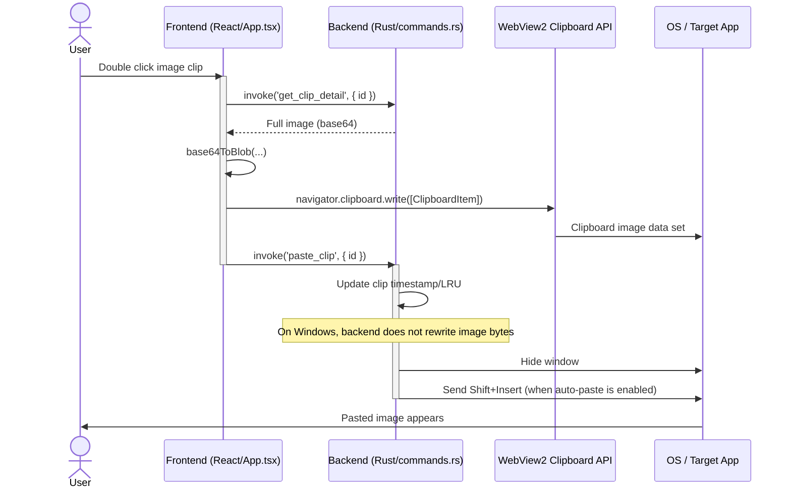

<h1 align="center">
    CyberPaste - Clipboard History Manager
</h1>

<p align="center">
  
  
  
  
</p>

**CyberPaste** is a beautiful clipboard history manager for Windows, built by **CyberGems** with Rust + Tauri + React + TypeScript. It automatically saves everything you copy and lets you search, organize and paste it instantly.

*Free and open source (GPLv3) — no ads, no tracking, and no data collection. Just enjoy it.*

> Official site: [cybergems.org](https://cybergems.org/) · Source: [github.com/CyberGems/CyberPaste](https://github.com/CyberGems/CyberPaste)

## Features

- 🔒 **Private** - 100% local SQLite storage, no cloud and no telemetry
- 🎨 **Polished UI** - Dark / Light / System themes with native Windows Mica & Mica-Alt, plus Full (grid) and Compact (list) modes with adjustable zoom, HUD and animations
- ⚡ **Fast & Lightweight** - Rust + Tauri 2.x core with virtualized lists and LRU caches for instant search and scrolling
- 📋 **Complete History** - Saves text, code, HTML, RTF, images, URLs and files with rich previews
- 🖥️ **Multi-Display Aware** - Always opens on the active monitor (cursor position)
- 🔍 **Instant Search & Filters** - Search by content and filter by type (text/code/image/url/file) and folder with live database counts
- 📁 **Folders** - Custom folders with wheel navigation and bulk move support
- 📌 **Pin & Bulk Actions** - Pin important clips, multi-select with `Ctrl/Shift+Click`, bulk move/delete and 2D keyboard navigation (`↑/↓/←/→`)
- 🖼️ **Detail Panel & Preview** - Slide-in detail panel, full-screen code preview with syntax highlighting and hover image peek
- 🔔 **Smart Notifications** - Configurable toasts (position, monitor, duration, click action) and sounds for copy, cut and duplicate events
- 🚫 **Application Exceptions** - Exclude sensitive apps by executable name or full path (case-insensitive)
- ⌨️ **Customizable Hotkey** - Reassignable global hotkey plus in-app shortcuts (`Ctrl+F`, `Enter`, `Delete`, `P`, etc.)
- 🤖 **AI Powered** - Summarize, translate, explain code and fix grammar via any OpenAI-compatible provider
- ⚙️ **Customizable AI** - Personalize each action's name and AI instructions (e.g., change *Translate* to *To Spanish*)

## Installation Guide

### 1. Install via Winget

```bash
winget install CyberGems.CyberPaste
```

### 2. Download from GitHub Releases (Windows)

Download the latest installer directly from:
[https://github.com/CyberGems/CyberPaste/releases](https://github.com/CyberGems/CyberPaste/releases)

> **Downloads:** [github.com/CyberGems/CyberPaste/releases](https://github.com/CyberGems/CyberPaste/releases)

## Keyboard Shortcuts

### Global
- **Toggle Window**: `Ctrl+Shift+V` (Default, Customizable in Settings)

### In-App
- `Ctrl + F` - Focus search
- `Escape` - Close window / Clear search
- `Enter` - Paste selected item
- `Delete` - Delete selected item
- `P` - Pin/Unpin selected item
- `Arrow Up/Down` - Navigate items

## Application Exceptions (Ignored Apps)

CyberPaste allows you to exclude specific applications from being recorded in the clipboard history. This is useful for privacy-sensitive applications like password managers or banking apps.

**Logic & Behavior:**
- **How to manage:** Go to Settings -> Ignored Applications. You can browse for an executable (`.exe`) or strictly type its name.
- **Privacy Protection:** When content is copied, CyberPaste checks the source application against your ignore list.
- **Robust Matching:** The system checks against **both**:
    1.  **Executable Name** (e.g., `notepad.exe`) - Matches any instance of this app regardless of location.
    2.  **Full File Path** (e.g., `C:\Windows\System32\notepad.exe`) - Matches only the specific installed instance.
- **Case Insensitive:** Matching is case-insensitive to ensure reliable detection on Windows.

## AI Features

CyberPaste integrates powerful AI capabilities to help you process your clipboard content more efficiently.

- **Actions:** Right-click any clip to access AI actions:
    - **Summarize:** Get a concise summary of long texts.
    - **Translate:** Translate content to your preferred language.
    - **Explain Code:** Understand complex code snippets instantly.
    - **Fix Grammar:** Polishing your writing with professional grammar checks.
- **Full Customization:**
    - **Custom Names:** Rename AI actions in Settings (e.g., change "Translate" to "To Spanish").
    - **Custom Prompts:** Override default system prompts to tailor the AI's behavior and output style.
    - **Provider Support:** Support for OpenAI, DeepSeek, and other OpenAI-compatible APIs.

You need to provide the API Key for the AI provider.

## Tech Stack

- **Backend**: Rust + Tauri 2.x
- **Frontend**: React 18 + TypeScript
- **Database**: SQLite
- **Styling**: Tailwind CSS
- **Package Manager**: pnpm

## Getting Started

### Prerequisites

- Node.js 18+
- Rust 1.70+
- pnpm

### Dev commands

```bash
# Install dependencies
pnpm install

# Install Tauri CLI
cargo install tauri-cli

# Run development build
pnpm tauri dev
```

### Building

```bash
# Build for production
pnpm tauri build
```

## Project Structure

```
    CyberPaste/
├── src-tauri/           # Rust backend
│   ├── src/
│   │   ├── main.rs      # App entry point
│   │   ├── lib.rs       # Core logic
│   │   ├── clipboard.rs # Clipboard monitoring
│   │   ├── database.rs  # SQLite operations
│   │   ├── commands.rs  # Tauri IPC commands
│   │   └── models.rs    # Data models
│   └── Cargo.toml
├── frontend/            # React frontend
│   ├── src/
│   │   ├── components/  # UI components
│   │   ├── hooks/       # React hooks
│   │   ├── types/       # TypeScript types
│   │   └── App.tsx
│   └── package.json
└── README.md
```

## Development Notes

### Tauri Command Argument Mapping

Tauri v2 enforces a strict case mapping between JavaScript/TypeScript and Rust:

- **JavaScript/Frontend:** Use `camelCase` for argument names in `invoke` calls (e.g., `filterId`).
- **Rust/Backend:** Use `snake_case` for function arguments in `#[tauri::command]` (e.g., `filter_id`).

**Example:**
*   **Frontend:** `invoke('get_clips', { filterId: 'pinned' })`
*   **Backend:** `pub fn get_clips(filter_id: Option<String>)`

Failure to follow this convention (e.g., passing `snake_case` from the frontend) will result in arguments being passed as `null` or `None` to the backend.

### Window Behavior & Multi-Monitor Support

The application is designed to appear on the **active monitor** (the one containing the mouse cursor) whenever the global hotkey is pressed.

- **Detection Logic:**
    - Located in `src-tauri/src/lib.rs` (`animate_window_show`).
    - Uses the Windows API `GetCursorPos` (via the `windows` crate) to determine the global mouse coordinates.
    - Iterates through `window.available_monitors()` to find the monitor whose bounds contain the cursor point.
    - Fallback: If the cursor position cannot be determined, it defaults to `window.current_monitor()`.

- **Positioning:**
    - The window is positioned at the bottom of the detected active monitor's work area (excluding taskbar).
    - An animation slides the window up from the bottom edge.

### Adjusting the Layout

The application uses a centralized layout system to ensure the native window and the virtualized list remain synchronized.

-   **Backend Constants:** `src-tauri/src/constants.rs` (Controls the OS window size).
*   **Frontend Constants:** `frontend/src/constants.ts` (Controls UI rendering and math).

#### How to change Card Height
The card height is dynamic and fills the available window space. To change it:
1.  Update `WINDOW_HEIGHT` in **both** `constants.rs` and `constants.ts` to the same value.
2.  Restart the application (required for Rust changes).

#### How to change Vertical Spacing (Safe Zones)
To add more or less space at the top/bottom of the cards (e.g., to prevent clipping during hover):
1.  Modify `CARD_VERTICAL_PADDING` in `frontend/src/constants.ts`.
2.  Increasing this value makes cards **shorter**; decreasing it makes them **taller**.


## Architecture & Design Decisions

### Why Frontend Clipboard for Images? (Solving "Thread does not have a clipboard open")

We use a **Hybrid Clipboard Approach** to solve the notorious Windows `OSError 1418` (Thread does not have a clipboard open).

-   **Backend (Rust)**: Great for monitoring the clipboard and handling database checks. However, on Windows, clipboard access is bound to the thread that created the window (STA). Trying to write images from a background Tokio thread often leads to race conditions and "OpenClipboard Failed" errors. The solution would be to write images on the main thread, but this severely slows down UI responsiveness and causes lag.
-   **Frontend (WebView2)**: The browser engine has a mature, stable implementation of `navigator.clipboard.write`.

**Our Solution:**
1.  **Frontend**: Writes the **Image Blob** directly to the system clipboard.
2.  **Backend**: Updates the internal database and triggers the paste shortcut (`Shift+Insert`).

### Why use `Shift+Insert` for Pasting?

We use `Shift + Insert` as the default paste trigger instead of `Ctrl + V`.

-   **Terminal Compatibility**: `Ctrl+V` often fails in terminal emulators (PowerShell, WSL, VS Code Terminal), sending a control character instead of pasting.
-   **Legacy Standard**: `Shift+Insert` is the universal paste standard recognized by virtually all Windows applications, including terminals and legacy software.

### Sequence Diagram for Image Pasting (Windows)



## Privacy and Security

- **Local storage only** - All clipboard history and settings are stored locally in SQLite. No data is sent externally except to the AI provider you configure.
- **Ignored apps** - Content from sensitive applications is never recorded.

## Contributing

Contributions are welcome. Please open an issue describing the change before starting large work, and submit pull requests against the main branch.

## Acknowledgments

Originally forked from [PastePaw](https://github.com/XueshiQiao/PastePaw) by [XueshiQiao](https://github.com/XueshiQiao). CyberPaste has since been extensively rewritten and expanded by [CyberGems](https://cybergems.org/).

This project also builds on open-source components including Tauri, React, SQLite and Rust — thanks to their authors and maintainers.

## Donate

**CyberPaste** is a personal open-source project within the **CyberGems** suite. I've spent thousands of hours building and refining it — both for my own use and to share premium-quality software with the world for free.

If you'd like to support this work, a donation would mean a lot. Thank you! 🙏

[](https://paypal.me/CyberGems) [](https://buymeacoffee.com/cybergems)

<details>
<summary>    Crypto donations — choose the correct network</summary>

| Asset | Network | Address | QR |
|---|---|---|---|
|  BTC | Bitcoin | `bc1q5mxzz05nmvsheqzx7970euswta3fksxzcfzag4` |  |
|  ETH | Ethereum (ERC20) | `0x79b703Ec0f77493679Fcd280aF3b983E20c580B8` |  |
|  USDT | Ethereum (ERC20) | `0x79b703Ec0f77493679Fcd280aF3b983E20c580B8` |  |
|  USDT | BNB Smart Chain (BEP20) | `0x79b703Ec0f77493679Fcd280aF3b983E20c580B8` |  |
|  USDT | Tron (TRC20) | `TSVbSk1HSyZ1NprCnAYiw56ECwXgH887mD` |  |
|  LTC | Litecoin | `LWGnEHgcFCE2BRkzLnsdPDD8Y8ZeDK577X` |  |

> ⚠️ Send only the selected asset on the indicated network. Using the wrong network will result in permanent loss of funds.

</details>

## License

CyberPaste is distributed under the terms of the **GNU General Public License v3.0**. See [`LICENSE`](LICENSE) for the full license text.
