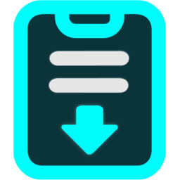

<p align="center">
  
</p>

<h1 align="center">CyberPaste - The Ultimate Clipboard Manager</h1>

<p align="center">
  <strong>A beautiful, privacy-focused clipboard history manager</strong> — stores everything you copy locally, so you can recall any clip at any time.
</p>

<p align="center">
  <a href="https://github.com/CyberGems/CyberPaste/releases/latest">
    
  </a>
  <a href="https://github.com/CyberGems/CyberPaste/releases">
    
  </a>
</p>

<p align="center">
  
  
  
  
  <a href="https://github.com/CyberGems/CyberPaste/wiki"></a>
</p>

A beautiful, privacy-focused **clipboard history manager** for Windows. CyberPaste stores everything you copy — text, code, images, files, URLs — in a local SQLite database, so you can recall any specific clip at any time. Search, organize, pin, edit, and paste instantly.

*Free and open source (GPLv3) — no ads, no tracking, and no data collection. Just enjoy it.*

---

## 📋 Why CyberPaste?

Most clipboard managers either send your data to the cloud or are too basic to be useful. CyberPaste gives you **the best of both worlds**: rich content support, AI-powered assistance, and rock-solid privacy — all in a lightweight Tauri app with a stunning cyberpunk aesthetic.

| Need | Solution |
|---|---|
| Recall anything you've copied | Full clipboard history with instant search and type filtering |
| Keep sensitive data private | Local-only SQLite — zero analytics, zero telemetry, no cloud |
| Work with rich content | Text, code (syntax highlighting), images (with OCR), HTML, RTF, files, URLs |
| Process clips with AI | Summarize, translate, explain code, fix grammar — works with any OpenAI-compatible provider |
| Stay organized | Folders, favorites, bulk management, dual view modes |
| Access anywhere | Global hotkey, multi-monitor aware, auto-paste injection |

---

## ✨ Key Features

### 📋 Clipboard Engine
- **Rich Content Support** — Automatically captures formatted Text, Code (with syntax highlighting and language badges), HTML, RTF, Images (with high-res viewer & OCR text extraction), URLs, and Files
- **Smart Monitoring** — Detects cut operations (Ctrl+X, Shift+Delete) via global keyboard hooks, duplicate detection, ghost clip filtering
- **Instant Search** — Real-time full-text search with quick filter chips (Text, Code, Images, Links, Files) and live database counters

### 🗂️ Organization
- **Folders** — Organize clips into custom folders with drag & drop and edge auto-scrolling
- **Favorites & Pinning** — Pin frequently used clips that stay at the top
- **Bulk Management** — `Ctrl+Click` / `Shift+Click` for multi-select, `Ctrl+A` to select all visible clips
- **Dual View Modes** — Full Mode (multi-column grid with zoom) or Compact Mode (high-density list with hover peek)

### 🤖 AI Assistant
- **Smart Actions** — Summarize, translate, explain code, or fix grammar
- **Provider Support** — OpenAI, DeepSeek, Ollama, Groq, OpenRouter, or any OpenAI-compatible API
- **Fully Customizable** — Custom prompts and action names for each AI operation

### 🔔 Notifications & Feedback
- **Smart HUD Toasts** — Corner notifications with countdown timer bars, duplicate detection, cut detection
- **Sound Effects** — Synthesized or custom sound effects for clipboard capture, duplicates, and activation

### 🔒 Privacy & Security
- **100% Local-First** — SQLite storage in WAL mode with fast indexes. Zero analytics, zero telemetry
- **Privacy Exceptions** — Ignore sensitive apps (password managers, banking tools) by process name or full executable path
- **Ghost Clip Filtering** — Option to ignore clips from unknown sources

### 🖥️ Desktop Integration
- **Global Hotkey** — Toggle the clipboard window (default: `Ctrl+Shift+V`)
- **Multi-Display Aware** — Automatically presents on the active monitor based on cursor position
- **Modular Window Ecosystem** — Separate optimized windows for Main Clipboard, System Tray Menu, Multi-tab Settings, Image Viewer & OCR, and Toast Notifications
- **Auto-Paste Injection** — Paste selected clips directly into the active application

### 🎨 Customization
- **4 Themes** — Dark, Light, CyberPaste (signature neon glow), and System
- **Mica Effects** — Native Windows Mica & Mica-Alt vibrancies with custom corner radiuses
- **Bilingual UI** — Complete native English and Spanish interface across all windows

---

## 🛠️ Tech Stack & Architecture

- **Platform:** Windows 10 / 11
- **Backend:** Rust + Tauri 2.x
- **Frontend:** React 18 + TypeScript + Tailwind CSS
- **Database:** SQLite (WAL mode)
- **Package Manager:** pnpm

```
CyberPaste/
├── src-tauri/               Rust backend & Tauri configuration
│   ├── src/
│   │   ├── main.rs          Entry point
│   │   ├── lib.rs           App initialization, shortcuts & window managers
│   │   ├── commands.rs      IPC command handlers & toasts
│   │   ├── clipboard.rs     Clipboard monitoring & capture engine
│   │   ├── database.rs      SQLite schema & persistence
│   │   ├── models.rs        Data structures & settings definitions
│   │   ├── ai.rs            AI integration (OpenAI-compatible API)
│   │   ├── highlight.rs     Syntax highlighting
│   │   ├── ocr.rs           OCR text extraction
│   │   └── settings_manager.rs
│   ├── Cargo.toml
│   └── tauri.conf.json
├── frontend/                React + TypeScript frontend
│   ├── src/
│   │   ├── components/      UI components (ClipCard, ClipList, ControlBar, Modals)
│   │   ├── windows/         Dedicated window views (Toast, Viewer, About, TrayMenu)
│   │   ├── hooks/           Custom React hooks (theme, language, keyboard)
│   │   ├── i18n/            Internationalization (English & Spanish)
│   │   ├── types/           TypeScript definitions
│   │   ├── utils/           Helper utilities
│   │   └── App.tsx          Main window application
│   └── package.json
└── README.md
```

---

## 🚀 Getting Started

### Install

```bash
winget install CyberGems.CyberPaste
```

Or download from [GitHub Releases](https://github.com/CyberGems/CyberPaste/releases).

### Development

**Prerequisites:** Node.js 18+, Rust 1.77+, pnpm

```bash
pnpm install
pnpm tauri dev
```

### Build

```bash
pnpm tauri build
```

---

## ⌨️ Keyboard Shortcuts

### Global

| Key | Action |
|---|---|
| `Ctrl+Shift+V` | Toggle clipboard window (customizable) |

### Navigation

| Key | Action |
|---|---|
| `↑` `↓` `←` `→` | 2D grid and list navigation |
| `Enter` | Paste selected clip (with auto-paste injection) |
| `Space` | Open full preview / detail panel |
| `PageUp` / `PageDown` / `Home` / `End` | Extended navigation with auto-scroll |

### Actions

| Key | Action |
|---|---|
| `Ctrl+C` | Copy selected clip to clipboard |
| `Ctrl+F` | Focus search input |
| `Ctrl+A` | Select all visible clips (bulk mode) |
| `Ctrl+M` | Toggle Full / Compact view mode |
| `Ctrl+Wheel` | Adjust grid zoom in Full mode (0.6x – 1.75x) |
| `P` | Pin / unpin selected item |
| `Delete` | Delete selected item |
| `Escape` | Clear search / close modal or window |

### Editor

| Key | Action |
|---|---|
| `Tab` | Insert 2 spaces |
| `Ctrl+S` / `Ctrl+Enter` | Save |
| `Escape` | Cancel |

---

## ❓ Frequently Asked Questions

### Is my clipboard data synced to the cloud?

No. CyberPaste stores everything locally in a SQLite database. No data is sent externally except to the AI provider you explicitly configure.

### How do I ignore sensitive applications?

Go to **Settings → Ignored Applications**. You can browse for an executable (`.exe`) or type its process name. CyberPaste checks against both executable name and full file path, case-insensitively.

### What content types does CyberPaste support?

Formatted text, code (with syntax highlighting), HTML, RTF, images (with high-res viewer and OCR text extraction), URLs, and file paths.

### How does the AI integration work?

Right-click any clip or use the detail panel to access AI actions (Summarize, Translate, Explain Code, Fix Grammar). You need an API key from a supported provider (OpenAI, DeepSeek, Ollama, Groq, OpenRouter, or any OpenAI-compatible API). Prompts and action names are fully customizable in Settings.

### What are the two view modes?

- **Full Mode** — Responsive multi-column grid with live zoom scaling, 2D keyboard navigation, and vertical or horizontal layout options.
- **Compact Mode** — High-density list with quick-access tabs, sidebar or horizontal folder bar, and hover peek preview.

### Can I install CyberPaste via Winget?

Yes. Run `winget install CyberGems.CyberPaste` in your terminal.

---

## 🤝 Contributing

Contributions are welcome. Please open an issue describing the change before starting large work, and submit pull requests against the main branch.

## 🙏 Acknowledgments

Originally forked from [PastePaw](https://github.com/XueshiQiao/PastePaw) by [XueshiQiao](https://github.com/XueshiQiao). CyberPaste has since been extensively rewritten and expanded by [CyberGems](https://cybergems.org/).

This project also builds on open-source components including Tauri, React, SQLite, and Rust — thanks to their authors and maintainers.

---

## ❤️ Donate

**CyberPaste** is a personal open-source project within the **CyberGems** suite. I've spent thousands of hours building and refining it — both for my own use and to share premium-quality software with the world for free.

If you'd like to support this work, a donation would mean a lot. Thank you! 🙏

<p align="center">
  <a href="https://www.paypal.com/donate/?hosted_button_id=M4PY3UPJA5Y6Q"></a>
  <a href="https://ko-fi.com/cybergems"></a>
  <a href="https://buymeacoffee.com/cybergems"></a>
</p>

<div align="center">

<details>
<summary><b>Crypto donations (BTC, ETH, USDT, LTC) — click to view addresses</b></summary>

<div align="left">

| Asset | Network | Address | QR |
|---|---|---|---|
|  **BTC** | Bitcoin | `bc1q5mxzz05nmvsheqzx7970euswta3fksxzcfzag4` |  |
|  **ETH** | Ethereum (ERC20) | `0x79b703Ec0f77493679Fcd280aF3b983E20c580B8` |  |
|  **USDT** | Ethereum (ERC20) | `0x79b703Ec0f77493679Fcd280aF3b983E20c580B8` |  |
|  **USDT** | BNB Smart Chain (BEP20) | `0x79b703Ec0f77493679Fcd280aF3b983E20c580B8` |  |
|  **USDT** | Tron (TRC20) | `TSVbSk1HSyZ1NprCnAYiw56ECwXgH887mD` |  |
|  **LTC** | Litecoin | `LWGnEHgcFCE2BRkzLnsdPDD8Y8ZeDK577X` |  |

> ⚠️ Send only the selected asset on the indicated network. Using the wrong network will result in permanent loss of funds.

</div>

</details>

</div>

---

## 📄 License

CyberPaste is distributed under the terms of the GNU General Public License v3.0. See [`LICENSE`](LICENSE) for the full license text.

---

<div align="center" style="background:#0D0F17; border:1px solid rgba(0,255,255,0.12); border-radius:12px; padding:28px 20px; margin-top:32px;">

### Thanks for using CyberPaste! 🎉

Made by [**CyberGems**](https://cybergems.org)

</div>
